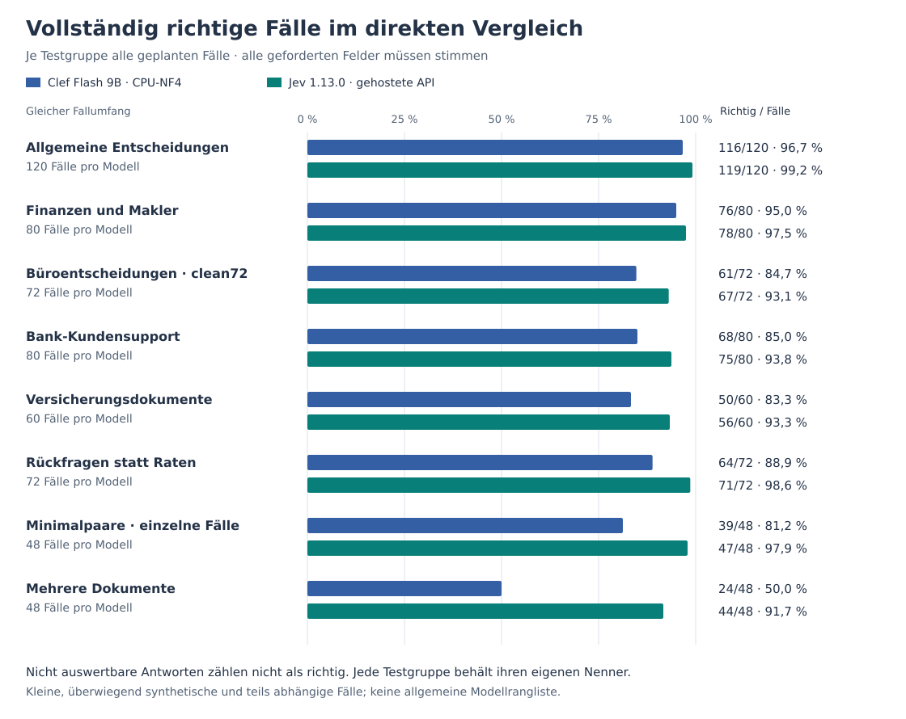
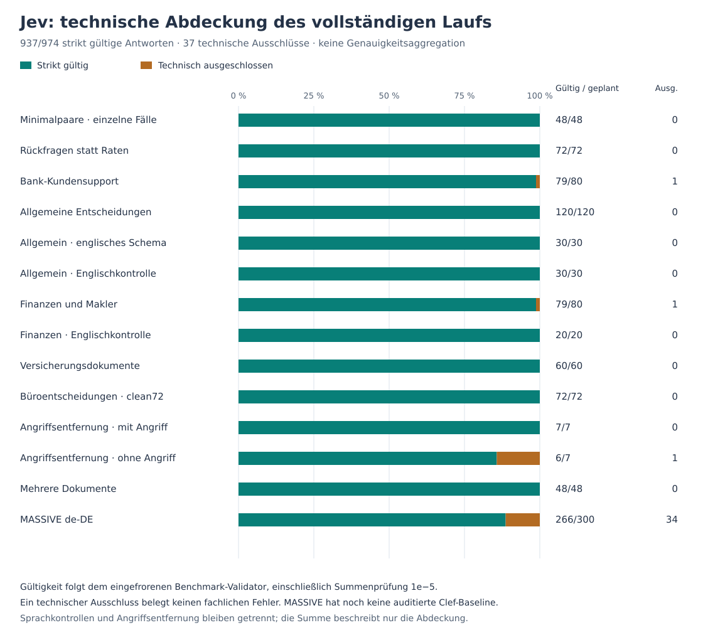
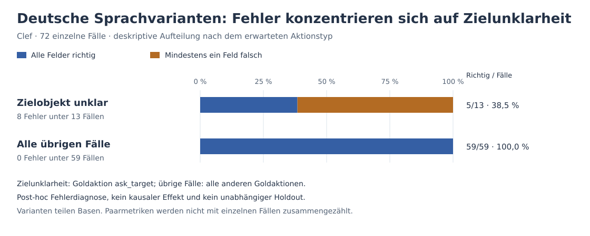

# Clef Lab

Deutsche Entscheidungsaufgaben mit Cloudflare Clef Flash 9B und ein Vergleich mit Jev 1.13.0. Das Repository enthält die Testeingaben, Referenzlabels, nativen Modellantworten, Auswertung und eine lokale Ergebnisansicht.

Getestet wurden unter anderem Bank-Support, Versicherungsregeln, notwendige Rückfragen, Minimalpaare und die Auswahl zwischen mehreren Dokumenten. Clef lief lokal im CPU-NF4-Profil mit originalem BF16-Decision-Head; Jev über eine gehostete HTTP-API. Die meisten Fälle sind kleine, KI-verfasste synthetische Tests mit fiktiven Regeln. Die Zahlen beschreiben diese Tests, keine allgemeine Modellrangliste oder Produktionsfehlerquote.

[Methodik](docs/EVALUATION_GUIDE.md) · [Vollständiger Jev-Vergleich](docs/JEV_COMPARISON.md) · [Reproduzieren](docs/REPRODUCE.md) · [Modell und Hardware](docs/HARDWARE.md)

<a id="ergebnisse"></a>

## Ergebnisse im direkten Vergleich

Ein Fall ist nur richtig, wenn **alle geforderten Felder** richtig sind. Die beiden Ergebnisspalten unten verwenden dieselben Fälle: diejenigen mit technisch gültiger Jev-Antwort und vorhandener Clef-Baseline. „Abdeckung“ zeigt, wie viele geplante Fälle dieser jeweiligen Testgruppe darin enthalten sind. Technische Ausschlüsse sind keine semantischen Modellfehler und werden separat ausgewiesen; sie dürfen auch nicht aus dem Bericht verschwinden.

| Testgruppe | Clef richtig auf gemeinsamen Fällen | Jev richtig auf gemeinsamen Fällen | Abdeckung | Jev technisch ausgeschlossen |
|---|---:|---:|---:|---:|
| Allgemeine Entscheidungen, deutscher Haupttest | 116/120 | 119/120 | 120/120 | 0 |
| Finanzen und Makler, deutscher Haupttest | 75/79 | 78/79 | 79/80 | 1 |
| Büroentscheidungen ohne Manipulation, clean72 | 61/72 | 67/72 | 72/72 | 0 |
| Bank-Kundensupport | 67/79 | 75/79 | 79/80 | 1 |
| Versicherungsdokumente | 50/60 | 56/60 | 60/60 | 0 |
| Rückfragen statt Raten | 64/72 | 71/72 | 72/72 | 0 |
| Minimalpaare, einzelne Fälle | 39/48 | 47/48 | 48/48 | 0 |
| Mehrere Dokumente | 24/48 | 44/48 | 48/48 | 0 |

Jev erreicht auf diesen gemeinsamen Teilmengen jeweils mehr vollständig richtige Fälle. Das ist ein beobachtetes Ergebnis der konkreten Aufgaben und Konfigurationen. Unterschiedliche Hardware, Quantisierung, Dienstgrenzen, synthetische Daten und abhängige Fälle begrenzen die Übertragbarkeit.

Der vollständige Jev-Durchlauf umfasst **974 versuchte Anfragen, 937 strikt gültige Antworten und 37 technische Ausschlüsse**, ohne fehlende Fälle oder Wiederholungsanfragen. Die 974 enthalten zusätzliche Sprachkontrollen, eine Angriffsentfernungs-Diagnose und MASSIVE; sie sind kein gemeinsamer Genauigkeitsnenner. Der [Detailvergleich](docs/JEV_COMPARISON.md) zeigt alle getrennten Teilgruppen sowie die Ergebnisse bezogen auf den gesamten geplanten Umfang. Clefs vollständige deutsche Bank- und Finanztests liegen bei **68/80** beziehungsweise **76/80**; die kleineren Clef-Nenner oben entstehen ausschließlich durch die gemeinsame Jev-gültige Auswahl.

### Weitere Befunde

- **Deutsche Sprachvarianten:** Clef löst 64/72 Fälle vollständig; 40/48 bedeutungsgleiche Paare sind an beiden Endpunkten richtig. Alle acht Fehler betreffen ein nicht eindeutig benanntes Zielobjekt. Kein Paar kippt von einer richtigen Basis zu einer falschen Variante. Die Varianten teilen zwölf Basen und sind nicht unabhängig. [Bericht](studies/language72/REPORT_DE.md)
- **Minimalpaare:** Clef löst 17/24 Paare vollständig. Alle zwölf gewünschten Ergebniswechsel verändern die Ausgabe, aber nur 8/12 Übergänge sind vollständig richtig. Stabilität allein genügt ebenfalls nicht: Zwei Paare bleiben stabil falsch. [Bericht und Fehler](experiments/minimal_pairs/REPORT.md)
- **Mehrere Dokumente:** Clef wählt 42/48 Quellen richtig, löst aber nur 24/48 Fälle vollständig. Die richtige Quelle bestätigt noch keine richtige Entscheidung. [Bericht](experiments/multidoc48/REPORT.md)
- **Hohe Scores:** Im Minimalpaartest bleiben bei Feldscore ≥0,90 vier von 36 ausgewählten Feststellungen und zwei von sieben Aktionen falsch. Die post-hoc Analyse ist keine Kalibrierung oder validierte Automatisierungsschwelle. [Scoreanalyse](experiments/probability_reliability/REPORT_DE.md)
- **MASSIVE de-DE:** Jev erreicht 219/266 auf strikt gültigen Antworten, bei 266/300 technischer Abdeckung; bezogen auf alle geplanten Fälle sind 219/300 gültig und richtig. Die auditierte Clef-Baseline steht noch aus. Es gibt deshalb noch keinen direkten MASSIVE-Vergleich. [Status und Datengrundlage](docs/JEV_COMPARISON.md#massive-und-weitere-tests)

<a id="schnellstart"></a>

## Ergebnisse lokal ansehen

Python 3.12+ genügt. Die gespeicherten Ergebnisse brauchen kein Modell, keine GPU und keine ML-Pakete.

```bash
git clone https://github.com/storminator89/clef-benchmark.git
cd clef-benchmark
python3 server.py
```

Öffne [http://127.0.0.1:8765](http://127.0.0.1:8765). Wähle einen Fall und vergleiche Originaltext, Regeln, Referenz und native Modellantwort. `web/index.html` nicht direkt per `file://` öffnen. Gespeicherte Antworten sind Replay eines ausgeführten Tests; die Ergebnisansicht führt keine neue Inferenz aus.

<a id="echte-lokale-inferenz-aktivieren"></a>

## Auswertung prüfen und neue Läufe ausführen

Die schnellste Prüfung arbeitet ausschließlich mit den gespeicherten Daten:

```bash
python3 scripts/check_project.py
python3 scripts/check_bank_support.py
python3 scripts/check_clarification.py
python3 scripts/check_paired_reliability.py
python3 scripts/check_multidoc.py
python3 scripts/check_jev.py
```

[Reproduzieren](docs/REPRODUCE.md) trennt Nachrechnen, Softwaretests und echte Modellinferenz. Für lokale Inferenz zuerst Hardwarebedarf und Installationsplan prüfen:

```bash
python3 -m runtime.setup --plan --profile cpu-nf4
```

Ein Modelllauf benötigt zusätzliche Pakete, die gepinnten Modellgewichte und ausreichend Arbeitsspeicher. Eigene synthetische Fälle können anschließend im lokalen Editor geprüft werden. [Setup](docs/AGENT_SETUP.md) · [Eigene Fälle](docs/CUSTOM_CASES.md) · [Agentenanleitung](AGENTS.md)

<a id="lizenz-und-attribution"></a>

## Daten und Grenzen

- Clef: `Cloudflare/clef-flash`, Revision `17f0b0ad64efb65d273590632833508766b2aae6`, nativer Decision Head. Die historischen Messungen gelten für CPU-NF4 mit BF16-Head, nicht für andere Modelle oder Hardwareprofile.
- Jev: versionierter Dienst `jev-1.13.0`; dieselben vorab fixierten Texte, Fragen und Optionen. Ein unveränderlicher Gewichtshash und die Serving-Hardware sind nicht verfügbar.
- Die synthetischen Labels wurden separat KI-geprüft, aber nicht durch ein unabhängiges menschliches Fachpanel validiert. Dokumentfamilien, Sprachvarianten und Paarendpunkte erzeugen Abhängigkeiten.
- Vollständige native Wahrscheinlichkeiten bleiben unverändert. Hohe Scores sind keine nachgewiesenen realen Fehlerwahrscheinlichkeiten. Lokale CPU-Forward-Zeit und gehostete HTTP-Latenz ergeben keinen fairen Geschwindigkeitsvergleich.
- Bilder sind vom Jev-Vergleich ausgeschlossen; es wurde kein OCR-Ersatz verwendet. Zusätzliche Jev-Sprachvarianten- und Mehrturntests sind noch nicht ausgeführt.

[Methodik und Evidenzpfade](docs/EVALUATION_GUIDE.md) · [Jev-Protokoll](experiments/jev_comparison/README.md) · [Lizenz](LICENSE) · [Quellen und Attribution](NOTICE)

Unabhängiges Projekt, ohne Zugehörigkeit zu oder Unterstützung durch Cloudflare oder TypeSafe.

## Visuelle Auswertung

Die Grafiken ergänzen die Tabellen; die exakten Fallzahlen bleiben maßgeblich. Alle Balken beginnen bei 0 und enden spätestens bei 100 %. Die drei Ansichten trennen fachliche Richtigkeit, technische Abdeckung und Fehlerdiagnose.

### 1. Gleiche Fälle, getrennte Testgruppen



Pro Zeile werden nur Fälle mit strikt gültiger Jev-Antwort und vorhandener Clef-Baseline verglichen. Bank und Finanzen enthalten deshalb jeweils 79 statt 80 Fälle. Die Balken zeigen bedingte Genauigkeit, keine Gesamtrangliste. [PNG-Ansicht](docs/charts/matched_accuracy.png)

### 2. Technische Abdeckung bleibt sichtbar



Hier bedeutet ein grüner Balken technisch gültig, nicht fachlich richtig. Die 37 Ausschlüsse bleiben sichtbar; die 974 Anfragen werden ausschließlich zur Vollständigkeitsbilanz addiert. MASSIVE ist ohne auditierte Clef-Baseline kein direkter Modellvergleich. [PNG-Ansicht](docs/charts/jev_coverage.png)

### 3. Sprachvarianten: Wo entstehen Fehler?



Die Einteilung folgt der Goldaktion `ask_target`, nicht der Modellvorhersage. Alle acht Fehler liegen in diesen 13 Fällen. Das ist eine nachträgliche Diagnose dieser kleinen Studie, kein kausaler Effekt; Varianten teilen Basen und sind nicht unabhängig. Einzelne Fälle und Paarmetriken werden nicht vermischt. [PNG-Ansicht](docs/charts/language_diagnostic.png)

[Grafiken reproduzieren, Daten und Darstellungsregeln](docs/charts/README.md). Der Generator liest die auditierten JSON-Dateien, prüft Fallzahlen gegen die Summen und erzeugt die SVG-Dateien ohne Modell, Netzwerk oder zusätzliche Python-Pakete.
