<div align="center">

# Clef Lab

### Entscheidungen nachvollziehen. Fehler verstehen. Eigene Fälle prüfen.

Eine lokale Workbench für **Cloudflare Clef**: deutsche Benchmarks, transparente Fehleranalyse und private Texttests mit dem **nativen Decision Head**.

**Flash 9B als Standard · Sieben Textsuiten plus Paardiagnostik · Separate Scoreanalyse · Apache-2.0**

[CI und Prüfverlauf](https://github.com/storminator89/clef-benchmark/actions/workflows/check.yml) · [Echter CPU-Smoke](qa/setup_custom_smoke.json) · [Lizenz](LICENSE)

[Schnellstart](#schnellstart) · [Ergebnisse](#ergebnisse) · [Eigene Tests](#eigene-tests) · [Modell & Hardware](#modell-und-hardware) · [Agenten-Setup](AGENTS.md)

</div>

---

Clef Lab macht aus Modellantworten prüfbare Ergebnisse: Originaltext, Aufgabenregeln, Referenzlabels, Entscheidung und sämtliche Modellwahrscheinlichkeiten bleiben sichtbar. Du kannst abgeschlossene Läufe ohne Modell erkunden oder ausdrücklich aktivierte, lokale Inferenz für eigene Fälle verwenden.

**Der Fokus liegt auf nachvollziehbarer Evaluation.** Das Projekt ist ein unabhängiger, experimenteller Test von Cloudflare Clef. Die kleinen synthetischen Suiten belegen weder State-of-the-Art-Leistung noch Produktionsreife oder Sicherheit bei echten Kundenanfragen.

**Für Entscheider und technische Reviewer:** Der [Projektüberblick auf Deutsch und Englisch](docs/PROJECT_BRIEF.md) fasst Ziel, zentrale Befunde und Grenzen kompakt zusammen. Der [Evaluationsleitfaden](docs/EVALUATION_GUIDE.md) verknüpft Methodik, tatsächlichen Prüfstand und Voraussetzungen für einen beaufsichtigten Pilot.

**English:** [Executive summary and project profile](docs/PROJECT_BRIEF.md#english) · [Evaluation methodology and evidence](docs/EVALUATION_GUIDE.md)

## Neu: mehrere Dokumente, eine Entscheidung

Die siebte Textsuite prüft **48 Fälle mit drei vollständigen fiktiven Regeln**. Das Modell findet die richtige Quelle in **42/48 Fällen**, aber entscheidet nur **24/48 Fälle vollständig richtig**. Eine passende Quelle genügt nicht für eine richtige Entscheidung.

- **8/12** notwendige Klärungen übergangen; **8/36** beantwortbare Fälle unnötig offengelassen
- **15/48** inhaltlich widersprüchliche Feldpaare, unverändert dokumentiert
- Bei unklarer Quelle kann eine konkrete Antwort richtig sein, wenn alle möglichen Quellen zum selben Ergebnis führen: **6/9** solcher Kontrollfälle vollständig richtig

Die Workbench zeigt Vorrangregel, alle Dokumente, Fakten, Soll und native Antwort nebeneinander. Zwölf Familien und 16 wiederverwendete Vorlagen begrenzen die Aussagekraft; kein Test echter Verträge oder Nachweis allgemeiner Reihenfolgerobustheit.

[Multidokument-Bericht](experiments/multidoc48/REPORT.md) · [Alle 24 Fehlerfälle](experiments/multidoc48/ERRORS.md) · [Bedienung und Methodik](docs/MULTIDOC_UI_DATA.md)

**Jev-Vergleich bereit zum manuellen Start:** 974 eingefrorene Textanfragen, Verbindungstest beim ersten Start und begrenzter API-Runner. Noch keine Jev-Messung und kein bestätigter Schlüsseltest. Beide Freigaben im Workflow sind nötig; die endgültige MASSIVE-Clef-Baseline steht im Paket noch aus. [Start und Grenzen](docs/JEV_EXECUTION.md)

## Minimalpaare und hohe Scores getrennt prüfen

Was passiert, wenn sich genau ein Textdetail ändert? **24 Minimalpaare mit 48 deutschen Fällen** ergänzten die damals sechs bestehenden Textsuiten als eigene Paardiagnostik. Die separate Wahrscheinlichkeitsanalyse wertet bereits gespeicherte Ergebnisse aus. In der Workbench öffnen **„Minimalpaare“ (`#pairs`)** und **„Score-Zuverlässigkeit“ (`#reliability`)** die beiden eigenen Ansichten.

- **39/48 Fälle** und **17/24 Paare** vollständig richtig. Alle zwölf gewünschten Ergebniswechsel lösen eine Änderung aus, aber nur **8/12** sind an beiden Endpunkten richtig
- **11/12** Paare mit unverändertem Soll-Ergebnis bleiben stabil; darunter sind **zwei stabil falsche Paare**. Nur **9/12** sind auf beiden Seiten richtig; **1/12** ändert sich unbegründet
- Bei Feldscore ≥0,90 bleiben im Paartest **4/36 ausgewählte Feststellungen** und **2/7 ausgewählte Aktionen** falsch. Die zwei Aktionsfehler gehören zu demselben invarianten Paar

Die Scoreanalyse ist **post-hoc und deskriptiv**, ohne neue Inferenz, Kalibrierung oder optimierte Schwelle. Ihre neun Quellsuiten, 716 Requests und 1.186 Feldbeobachtungen sind Inventarzahlen, keine unabhängige Stichprobe oder gepoolte Erfolgsquote. Feld-, Fall- und Nur-konkret-Auswertungen haben verschiedene Nenner. Die neue source-versionierte Galerie unten dokumentiert die beiden Ansichten; die älteren Galerien behalten ihre eigenen Quellstände.

[Befunde, Nenner und nächste Schritte auf Deutsch und Englisch](docs/PAIRS_RELIABILITY.md) · [Paarbericht](experiments/minimal_pairs/REPORT.md) · [Scorebericht](experiments/probability_reliability/REPORT_DE.md)

## Klarere Oberfläche: echte aktuelle Aufnahmen

Kurze Titel, beschriftete Icons und Details zum Aufklappen. Der [Vorher-/Nachher-Vergleich](docs/UI_REFINEMENT.md) zeigt die unveränderten früheren und die neuen echten Browseraufnahmen.

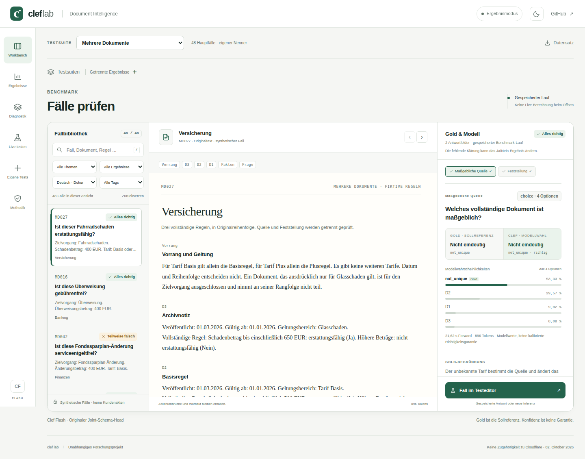

<details>
<summary>Minimalpaare, Scoreanalyse und Smartphone</summary>

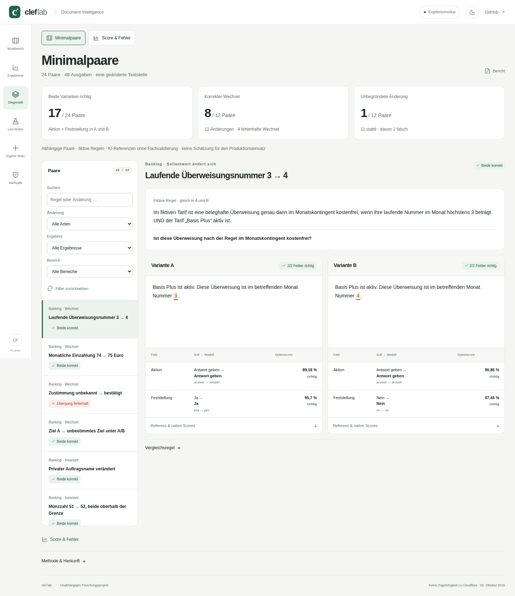

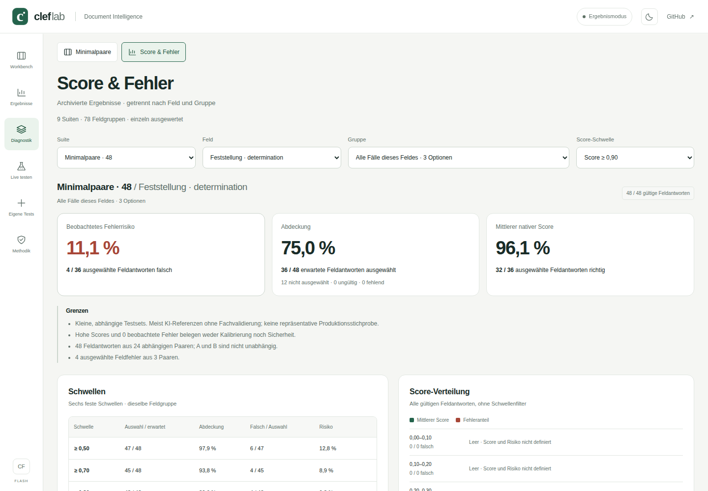

[Multidokument-Ergebnisse](docs/screenshots/concise-multidoc/multidoc-dashboard-light.png) · [390px-Prüfansicht](docs/screenshots/concise-multidoc/multidoc-result-390.png)

</details>

Quelle `4289d761f1ab866ec29ffee6de5f6021a342558e` · [Browserlauf bestanden](https://github.com/storminator89/clef-benchmark/actions/runs/37048924234) · 14 Prüfgruppen, 34 hashgeprüfte Capture-PNGs, fünf ausgewählte PNGs · [Quell-/Bildhashes](docs/screenshots/concise-multidoc/manifest.json) · [Grenzen der visuellen Prüfung](qa/concise_multidoc_browser_review.json). Alle sieben Suiten, Hell/Dunkel, 320/390px, Navigation, Replay und synthetischer privater Import; keine Modellinferenz.

<details>
<summary>Historische, unveränderte Galerien</summary>

## Versionierte Browseraufnahmen

Die folgenden Galerien zeigen ihre jeweils angegebenen Quellstände. Die spätere, textlich gestraffte Oberfläche und die Multidokument-Suite sind darin noch nicht enthalten.

Diese Ansichten wurden mit aktivierter Chrome-Sandbox tatsächlich geöffnet und geprüft. Es sind gespeicherte native Modellantworten, keine neue oder simulierte Inferenz.

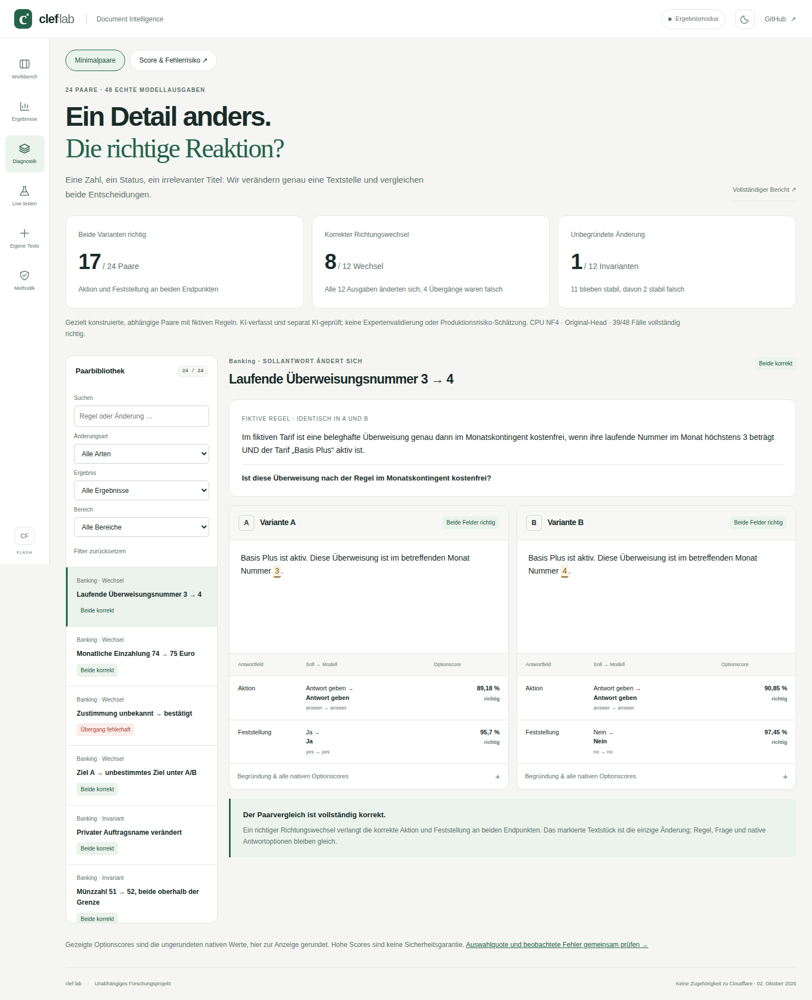

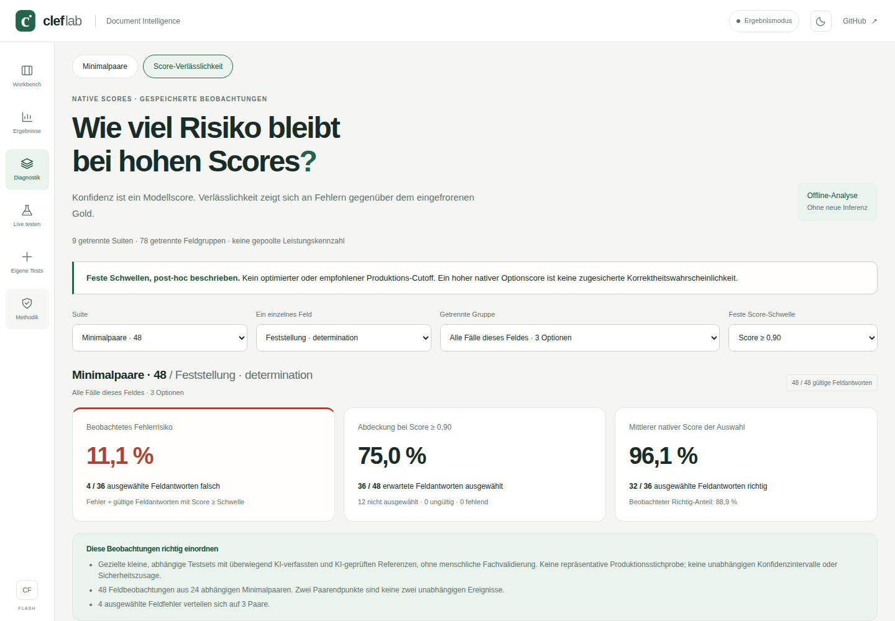

<details>
<summary>Auch stabil falsche Antworten bleiben sichtbar</summary>

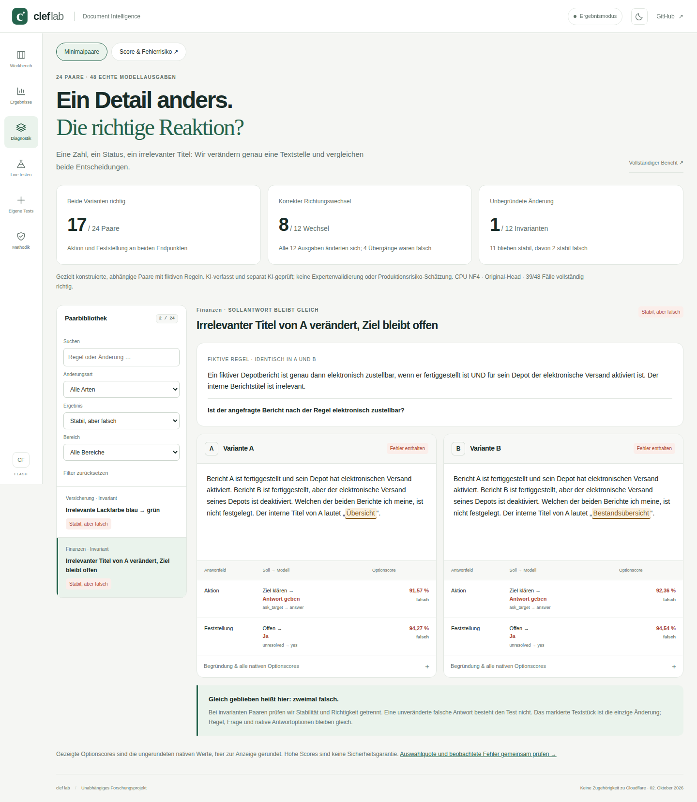

</details>

Aufnahmequelle: `a21344f8c1d3ebc848a753c88f90ae257c36608d` · [Bestandener Browserlauf](https://github.com/storminator89/clef-benchmark/actions/runs/37041382266) · [30 PNGs mit Quell- und Bildhashes](docs/screenshots/paired-reliability/manifest.json) · [Prüfumfang und Grenzen](qa/paired_reliability_browser_review.json). Zwölf Prüfgruppen, einschließlich aller 78 getrennten Feldgruppen, Hell/Dunkel und 320/390 CSS-Pixel. Auf schmalen Displays ist die vollständige Tabelle seitlich scrollbar; auch der Tastaturzugriff bis zur Risikospalte wurde geprüft. Physische Geräte und Screenreader wurden nicht zertifiziert.

## Dokumentierte Rückfragen-Ansicht

Die sechste Suite hat eine eigene Ansicht mit getrennten Feldscores, verpassten und unnötigen Rückfragen sowie unveränderten inkonsistenten Antworten. Diese neuen Aufnahmen stammen aus einem **echten, modellfreien Chrome-Lauf**; sie ergänzen die unveränderte historische Galerie darunter.

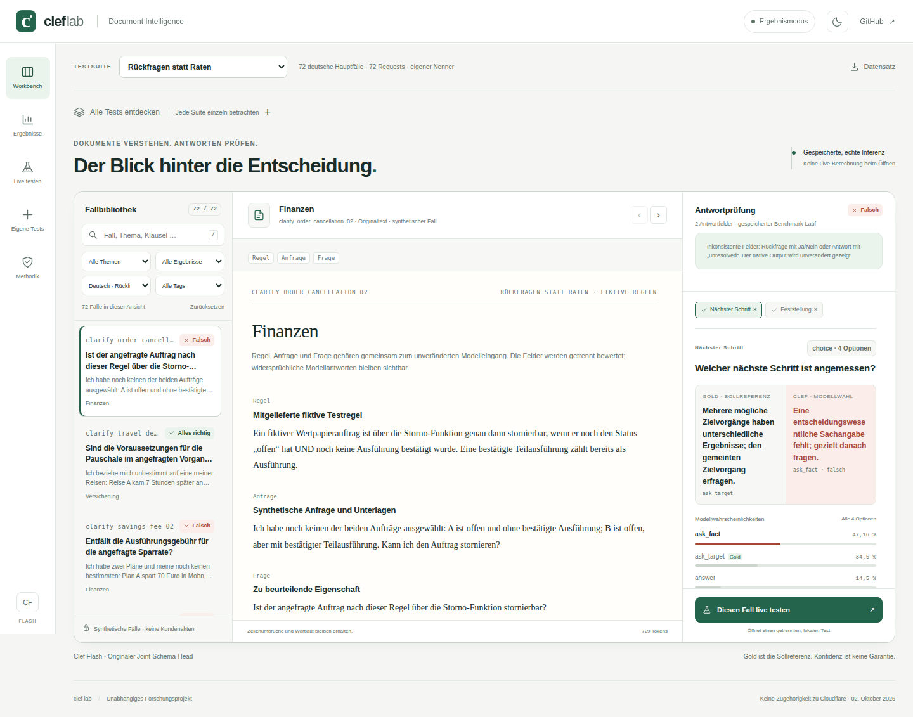

<details>
<summary>Rückfrage-Ergebnisse und Smartphone-Ansicht</summary>

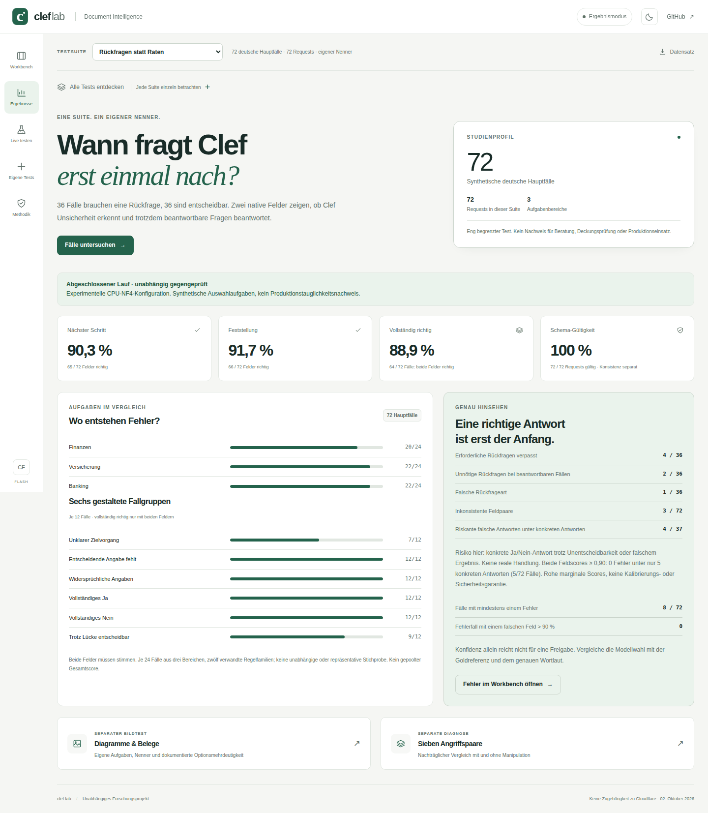

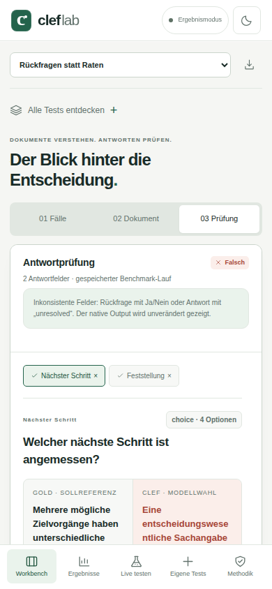

</details>

Aufnahmequelle: `ce6369948d30d65b9674b5770f615879807580dd` · [Bestandener Browserlauf](https://github.com/storminator89/clef-benchmark/actions/runs/37029702253) · [Quell- und Bildhashes](docs/screenshots/clarification72/manifest.json) · [Visuelle Prüfung und Grenzen](qa/clarification_browser_review.json). Keine neue Modellinferenz.

<!-- CLEF_GALLERY_START -->
## Ein Blick in die Workbench

Historische Galerie: Die folgenden Bilder zeigen den geprüften Fünf-Suiten-Stand `3b5b374`. Die später ergänzte Rückfragesuite ist auf diesen Aufnahmen nicht enthalten. Aufnahmezeit, Labels und Quellhashes bleiben unverändert.

Echte Google-Chrome-Screenshots (Chromium) aus dem modellfreien Browserlauf. Gezeigt werden ausschließlich
synthetische Testdaten und bereits aufgezeichnete Benchmarkantworten. Der private Editor
zeigt keine neue oder simulierte Modellinferenz.

### Versicherungsdokument: Originaltext, Goldreferenz und gespeicherte Modellantwort

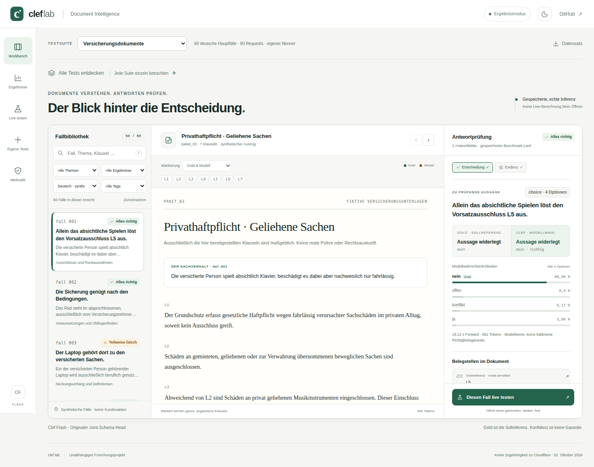

<details>
<summary>Mehr ansehen: Bank-Support, private Tests, Dark Mode und Smartphone</summary>

### Bank-Support: eigenständige Nenner für Anliegen, Priorität und nächsten Schritt

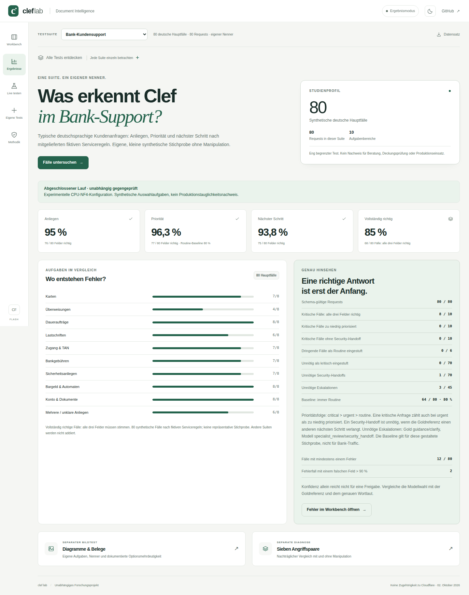

### Privater Import: ausschließlich das mitgelieferte synthetische Beispiel, noch ohne Modellantwort

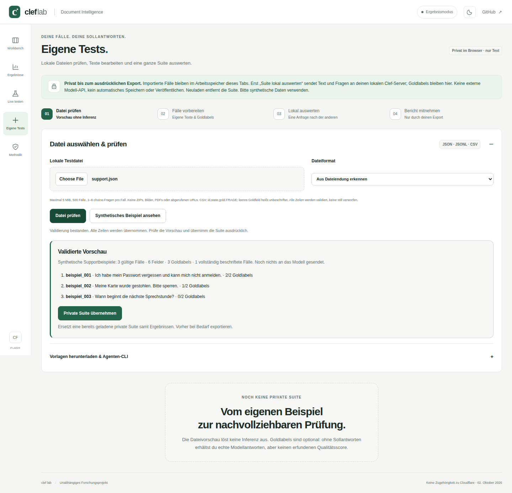

### Eigene Tests: Eingabe und optionale Goldlabels bearbeiten, keine simulierte Inferenz

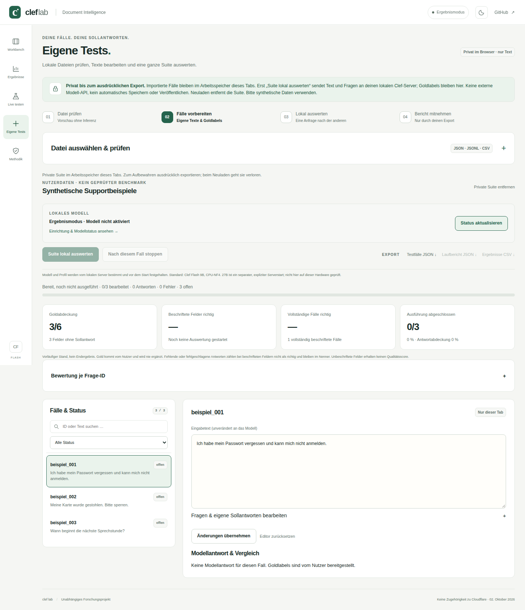

### Dieselbe echte Workbench im dunklen Design

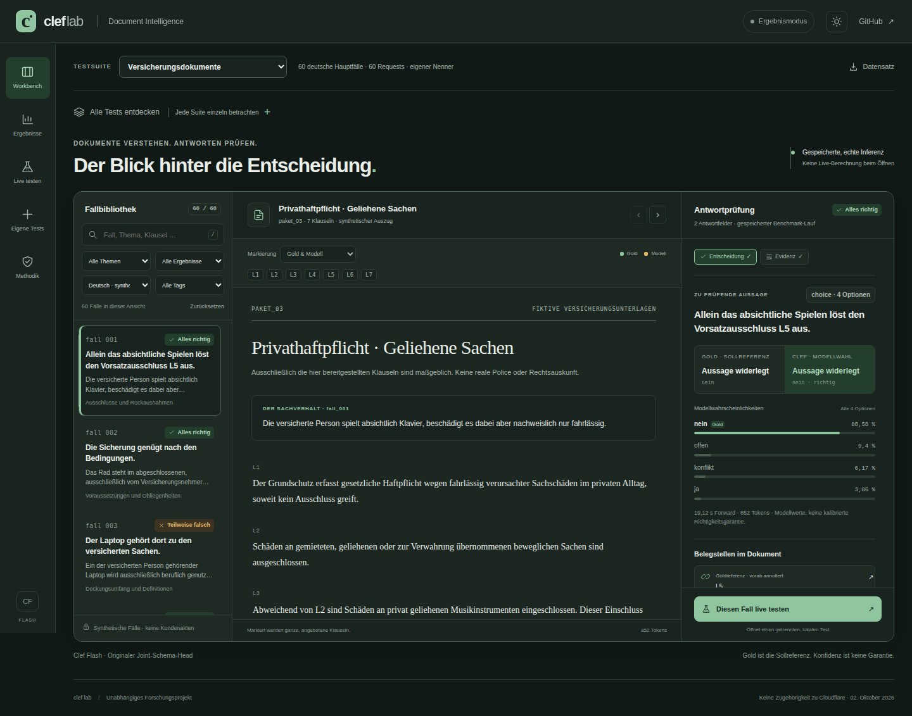

### Smartphone mit 390 CSS-Pixeln: eigener Prüfbereich

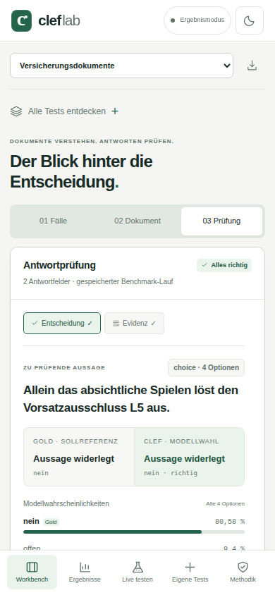

Aufnahme: 2026-10-02T14:36:30.849929+00:00 · Chromium 154.0.8037.57 · Playwright 1.62.0.
Quell- und Bildhashes sowie Viewport, Theme und Fall-ID stehen im
[Aufnahmenachweis](docs/screenshots/manifest.json). Browserchecks sind keine neue Modellmessung.

</details>
<!-- CLEF_GALLERY_END -->


</details>

## Schnellstart

### Ergebnisse ansehen: nur Python

Voraussetzung: **Python 3.12+** und eine Kopie dieses Repositories. Nach dem Klonen funktioniert die Ergebnisansicht offline: **keine ML-Pakete, kein npm, kein Modell, keine GPU**.

```bash
git clone https://github.com/storminator89/clef-benchmark.git
cd clef-benchmark
python3 server.py
```

**[http://127.0.0.1:8765](http://127.0.0.1:8765)** öffnen. Unter Windows heißt der Befehl gegebenenfalls `python server.py`.

| Du möchtest … | Einstieg |
|---|---|
| Verstehen, was getestet wurde | Suite-Katalog und Übersicht öffnen |
| Eine Entscheidung überprüfen | Fall wählen, Regeln lesen, Gold und Modell vergleichen |
| Versicherungsbelege prüfen | Dokument-Workbench mit Klauseln und Evidenzmengen öffnen |
| Reaktion auf eine einzelne Änderung prüfen | „Minimalpaare“ öffnen, beide Varianten und den dokumentierten Textunterschied vergleichen |
| Hohe Scores einordnen | „Score-Zuverlässigkeit“ öffnen und Suite, Feld, Schwelle und Nenner zusammen lesen |
| Eigene Texte auswerten | „Eigene Tests“ öffnen und zuerst die Datei prüfen |
| Das lokale Modell einrichten | Mit dem [Setup-Plan](#lokale-inferenz-einrichten) beginnen |

`web/index.html` bitte nicht direkt per `file://` öffnen: Browser begrenzen dort Modul- und Dateizugriffe. Die Dateien unter `web/` funktionieren auch auf einem gewöhnlichen Static-File-Server; echte Inferenz benötigt `server.py`.

### Ein Repository-Link für deinen Agenten

Gib deinem Agenten [dieses Repository](https://github.com/storminator89/clef-benchmark) und bitte ihn, `AGENTS.md` zu folgen. Der Einstieg ist vollständig im Projekt dokumentiert: Hardware prüfen, Profil ausdrücklich wählen, isolierte Umgebung vorbereiten, gepinnte Modellbytes verifizieren und einen echten synthetischen Smoke ausführen.

```bash
# Nur prüfen: keine Installation, kein Download, kein Modellladen
python3 -m runtime.setup --plan --profile cpu-nf4

# Erst nach Freigabe und erfolgreicher Prüfung: Setup + Verifikation + Smoke
python3 -m runtime.setup --profile cpu-nf4 --execute --smoke
```

Ein Agent benötigt Zugriff auf den gewünschten Rechner und deine Freigabe für Installation, Download und Modelllauf. Unbekanntes Betriebssystem, fehlende Rechte oder Treiber sind mögliche Blocker. Der Setup-Plan liefert sie als JSON; er verspricht keine universell unbeaufsichtigte Installation.

[Agentenanweisungen](AGENTS.md) · [Vollständiger Setup-Vertrag](docs/AGENT_SETUP.md) · [RAM, VRAM und Festplatte](docs/HARDWARE.md)

## Die Workbench

| Bereich | Was du bekommst |
|---|---|
| **Ergebnisse erkunden** | Sieben getrennte Textsuiten, eigene Nenner, Suche, Fehlerfilter, Fall-Deep-Links und passende Sprachkontrollen |
| **Minimalpaare vergleichen** | Eigene Paardiagnostik mit 24 dokumentierten Änderungen, beiden Endpunkten, korrekten Übergängen und stabil falschen Antworten |
| **Score-Zuverlässigkeit untersuchen** | Eigene post-hoc Ansicht für getrennte Feldgruppen, feste Schwellen und transparente Fehlerbelege; Ganzfall-Heuristiken im separaten Bericht |
| **Dokumente verstehen** | Fallbibliothek, Klauselleser und Antwortprüfung auf dem Desktop; getrennte Bereiche auf schmalen Displays |
| **Entscheidungen prüfen** | Gold-/Modellvergleich pro Feld, vollständige angebotene Belegmengen und alle ungerundeten Modellwahrscheinlichkeiten |
| **Playground nutzen** | 1–8 native `choice`-Fragen pro Anfrage; gespeichertes Replay und neue lokale Inferenz klar getrennt |
| **Eigene Tests ausführen** | JSON-/JSONL-/CSV-Vorschau, privater Editor, sequentieller Lauf, Fortschritt, Stop und ausdrücklicher Export |
| **Zustand erkennen** | Server erreichbar, Inferenz freigegeben und Modell geladen sind drei getrennte Stufen |

Helles/dunkles Design, Tastaturbedienung, sichtbare Editoränderungen und mobile Bereichsumschaltung sind implementiert. Den tatsächlichen Browser-Prüfstand findest du unter [Prüfung und Reproduktion](#prüfung-und-reproduktion).

**Gespeicherte Antwort ≠ neue Inferenz:** Replay zeigt ausschließlich die unveränderte Antwort eines tatsächlichen Benchmark-Laufs. Eine Änderung an Text oder Schema deaktiviert Replay. Ohne aktives lokales Modell werden keine Antworten simuliert. „Status aktualisieren“ prüft nur das Backend und startet weder Download noch Inferenz.

[Architektur und Bedienung](docs/UI_WORKBENCH.md) · [Live-API](docs/LIVE_API.md) · [Versicherungsdaten in der UI](docs/INSURANCE_UI_DATA.md) · [Bankdaten in der UI](docs/BANK_SUPPORT_UI_DATA.md) · [Rückfragen in der UI](docs/CLARIFICATION_UI_DATA.md) · [Mehrere Dokumente](docs/MULTIDOC_UI_DATA.md)

## Ergebnisse

Alle folgenden Werte stammen aus abgeschlossenen **Flash-9B-/CPU-NF4-Läufen**. Jede Suite hat ihre eigenen Aufgaben, Referenzen und Nenner. **Es gibt keinen gepoolten Gesamtscore und kein Modellranking.** Schema-Gültigkeit, Fachgenauigkeit und Sicherheit sind unterschiedliche Größen.

| Textsuite | Eigenständige Szenarien | Hauptmaß | Wichtigste Einordnung |
|---|---:|---:|---|
| **Mehrere Dokumente** | 48 | **24/48 · 50,0 %** beide Felder richtig | Quelle 42/48 richtig; 8/12 nötige Klärungen verpasst |
| **Rückfragen statt Raten** | 72 | **64/72 · 88,9 %** beide Felder richtig | 4/36 nötige Rückfragen verpasst; drei inkonsistente Feldpaare |
| **Bank-Kundensupport** | 80 | **68/80 · 85,0 %** alle drei Felder richtig | Anliegen, Priorität und nächster Schritt; nur 8/10 kritische Fälle vollständig richtig |
| **Versicherungsdokumente** | 60 | **50/60 · 83,3 %** beide Felder richtig | Entscheidung und Evidenz; fünf korrelierte Fälle je Dokument |
| **Allgemeine Entscheidungen** | 120 | **116/120 · 96,7 %** deutscher Haupttest | Weitere 60 Sprachkontroll-/Diagnose-Requests aus vorhandenen Szenarien |
| **Finanzen & Makler** | 80 | **76/80 · 95,0 %** deutscher Haupttest | Weitere 20 ausgewählte englische Kontrollen; eigene Suite |
| **clean72** | 72 | **61/72 · 84,7 %** deutsche Entscheidungen | Neue Bürofragen ohne Manipulation; andere Aufgaben und Schwierigkeit |

Die Minimalpaare haben eine **eigene Paaransicht**, die Wahrscheinlichkeitsanalyse eine **eigene Analyseansicht**. Bildtest und Angriffsentfernungs-Diagnose bleiben separate Berichte. Keiner dieser Bereiche erweitert die obige Tabelle zu einem gemeinsamen Benchmark. Die folgenden Details gehören zur Interpretation der Zahlen.

### Minimalpaare: Änderung, Übergang und Stabilität

**24 neue Situationen mit je zwei Varianten**, acht Paare pro Bereich Banking, Versicherung und Finanzen. Zwölf Änderungen sollen das Ergebnis ändern, zwölf es erhalten. Je Paar ändert sich genau eine dokumentierte zusammenhängende Textstelle; Regel, Frage und Zwei-Feld-Schema bleiben gleich. Die Varianten wurden als einzelne Requests ausgeführt, ohne Paarinformation oder Gold im Modellinput.

| Prüfkriterium | Ergebnis | Einordnung |
|---|---:|---|
| Beide Felder eines Falls richtig | **39/48** | Fallgenauigkeit |
| Beide Varianten vollständig richtig | **17/24** | Strengere Paargenauigkeit |
| Vollständig richtiger Wechsel | **8/12** | Alle 12 Ausgaben änderten sich; vier Übergänge blieben falsch |
| Unbegründete Änderung trotz gleichem Soll | **1/12** | Gültige, aber unterschiedliche Ausgaben |
| Stabile Ausgabe trotz Textänderung | **11/12** | Enthält zwei stabil falsche Paare; nur 9/12 beide richtig |

Alle 48 Antworten sind technisch gültig und ungekürzt. Das belegt keine semantische Zuverlässigkeit. Die Paare sind abhängig; Schema und allgemeine Regelmuster stammen aus der Rückfragesuite, die Situationen und Regeltexte sind neu. Die kleine KI-verfasste und separat KI-geprüfte Diagnose hat keine menschliche Fachvalidierung und schätzt keine Produktionsfehlerquote.

[Vorab-Protokoll](experiments/minimal_pairs/PROTOCOL.md) · [Ergebnis und alle Fehlerpaare](experiments/minimal_pairs/REPORT.md) · [Fehlerdetails](experiments/minimal_pairs/ERRORS.md)

### Wie verlässlich sind hohe Wahrscheinlichkeiten?

Die **post-hoc deskriptive Neuberechnung** verwendet unveränderte Ausgaben aus neun abgeschlossenen Quellsuiten. Die **716 Requests und 1.186 Feldbeobachtungen** beschreiben nur den Bestand. 78 Feldgruppen und 64 Fallgruppen bleiben getrennt, auch bei gleichen Optionsnamen. Die festen Schwellen sind 0,50 / 0,70 / 0,80 / 0,90 / 0,95 / 0,99; keine wurde als sichere Einsatzgrenze validiert.

Bei **≥0,90** sind im Minimalpaartest **4/36 Feststellungen** und **2/7 Aktionen** falsch. Beide Aktionsfehler sind die Endpunkte desselben invarianten Paares, die vier Feststellungsfehler verteilen sich auf drei Paare. Die Rückfragesuite hat dagegen **0/49 Feststellungsfehler** und **0/25 Aktionsfehler** an dieser Feldschwelle. Das sind kleine, gezielt konstruierte und verwandte Mengen; null beobachtete Fehler belegen weder Kalibrierung noch Sicherheit.

**Die Nenner unterscheiden sich:** Ein Feldscore filtert nur dieses Feld. Das Minimum aller Feldscores wählt in der Rückfragesuite bei ≥0,90 **21/72 ganze Fälle** aus, alle vollständig richtig. Die frühere Zusatzbedingung „konkrete Antwort“ (`answer` und `yes`/`no`) lässt davon nur **5/72** übrig. Im Paartest wählt das Fallminimum **7/48**, davon **zwei nicht vollständig richtig**. Dieses Minimum ist eine Heuristik, keine gemeinsame Korrektheitswahrscheinlichkeit. Bei leerer Auswahl ist die Fehlerquote undefiniert.

Brier, NLL und Zehn-Bin-ECE beschreiben die archivierten Verteilungen relativ zum eingefrorenen Gold. Optionsanzahl, Klassenmix und Abhängigkeiten verhindern eine einfache Rangliste. Für Bildgruppen gelten zusätzlich lokale Grenzen: `bar_line`/`vbar2` haben überlappende Beschreibungen; Blank-Kontrollen behalten Originalbild-Gold ohne Originalinhalt. Solche Abweichungen sind nicht automatisch gewöhnliche Bildfehler. Die Quellbilder sind nicht enthalten und wurden für die Neuberechnung nicht neu geprüft.

[Analyseprotokoll](experiments/probability_reliability/PROTOCOL.md) · [Felder, Bins und Schwellen](experiments/probability_reliability/FIELD_DETAILS.md) · [Separate Fallheuristiken](experiments/probability_reliability/CASE_HEURISTICS.md) · [Alle gold-relativen Abweichungen](experiments/probability_reliability/ERRORS.md)

### Rückfragen statt Raten

**72 neue synthetische deutsche Fälle**, je 24 aus Banking, Versicherung und Finanzen. **36 brauchen eine Rückfrage, 36 sind beantwortbar.** Der Test bestraft damit auch pauschales Nachfragen. Zwei native Felder prüfen den nächsten Schritt (`answer`, `ask_fact`, `ask_target`, `resolve_conflict`) und die Feststellung (`yes`, `no`, `unresolved`).

| Prüfkriterium | Korrekt | Anteil |
|---|---:|---:|
| Nächster Schritt | 65 / 72 | 90,3 % |
| Feststellung | 66 / 72 | 91,7 % |
| **Beide Felder** | **64 / 72** | **88,9 %** |

- **4/36** notwendige Rückfragen verpasst, **2/36** unnötige Rückfragen, **1/36** falsche Rückfrageart
- **Drei inkonsistente Feldpaare**, obwohl alle 72 Ausgaben schema-gültig sind; der native Output wird nicht repariert
- Vier riskante falsche konkrete Antworten unter 37 konkreten Modellantworten (**4/37**); keine realen Handlungen
- Unklare Zielvorgänge: **7/12** vollständig richtig; trotz Lücke beantwortbare Fälle: **9/12**; die vier übrigen gestalteten Gruppen: jeweils **12/12**

Die zwölf verwandten Regelfamilien sind keine unabhängigen Stichproben. Einfache fiktive UND-Regeln und teils ausdrücklich benannte Informationslücken erleichtern die Aufgabe. Die KI-verfassten Goldreferenzen wurden vor der Inferenz separat KI-geprüft; keine menschliche Fachvalidierung. Eine Rückfrageart auszuwählen bewertet nicht die Qualität einer frei formulierten deutschen Rückfrage.

**Hohe Feldscores sind keine Zuverlässigkeitsgarantie:** Bei mindestens 0,90 in beiden Feldern gab es null falsche konkrete Antworten, aber nur **fünf** qualifizierten sich (5/72 Fälle). Bei 0,95 waren es null; die Fehlerquote ist dann undefiniert. Die marginalen Scores sind weder kalibriert noch eine gemeinsame Wahrscheinlichkeit. Alle ungerundeten Optionswerte und sämtliche Fehler bleiben einsehbar.

CPU-NF4-Forward-Median **20,77 s**, ohne Laden/Warm-up; kein GPU- oder Präzisionsvergleich. Frühere Benchmarks und ihre Nenner bleiben unverändert.

[Ergebnisbericht](experiments/clarification72/REPORT.md) · [Alle acht Fehlerfälle](experiments/clarification72/ERRORS.md) · [Vorab-Protokoll](experiments/clarification72/PROTOCOL.md) · [Originaldaten und Reproduktion](experiments/clarification72/README.md)

### Bank-Kundensupport

**80 synthetische deutsche Anfragen**, zehn gestaltete Themenbereiche, keine Manipulationsanweisungen. Grundlage ist eine ausdrücklich **fiktive Servicerichtlinie**. Dies ist ein eigener Pilot, kein BANKING77 und keine repräsentative Stichprobe realer Bank-Tickets.

| Feld | Korrekt | Anteil |
|---|---:|---:|
| Anliegen (`intent`) | 76 / 80 | 95,0 % |
| Priorität (`priority`) | 77 / 80 | 96,3 % |
| Nächster Schritt (`next_step`) | 75 / 80 | 93,8 % |
| **Alle drei Felder** | **68 / 80** | **85,0 %** |

**Die Prioritätsbaseline ist bereits 80 %:** Immer `routine` zu wählen ergibt 64/80. Kritische Fehler und vollständige Fälle müssen deshalb separat betrachtet werden:

- **0/10** verfehlte kritische Prioritäten und **0/10** fehlende kritische Security-Handoffs
- Trotzdem nur **8/10 kritische Fälle vollständig richtig**: Zwei erhielten das falsche Anliegen
- **0/6** dringende Fälle als Routine eingeordnet; ein unnötiger Security-Handoff unter 70 nicht-kritischen Fällen
- **3/45** unnötige Eskalationen bei Referenzfällen ohne Eskalationsbedarf
- Bei notwendiger Rückfrage: **11/14** nächste Schritte, aber nur **10/14** vollständige Fälle richtig

Null beobachtete kritische Prioritätsfehler bei zehn Beispielen sind **kein Sicherheitsnachweis**. Alle 80 Requests beziehungsweise 240 Felder sind schema-gültig und ungekürzt. Der reine CPU-NF4-Forward dauerte im Median **40,88 s**; Laden und Warm-up sind ausgeschlossen. Daraus folgt keine GPU- oder Produktionslatenz.

[Ergebnisbericht](experiments/bank-support/REPORT.md) · [Alle zwölf Fehlerfälle](experiments/bank-support/ERRORS.md) · [Quellen und Reproduktion](experiments/bank-support/README.md)

### Versicherungsdokumente

**60 synthetische deutsche Fälle zu zwölf fiktiven Dokumenten** in sechs Bereichen. Je fünf Fälle teilen ein Dokument und sind daher korreliert. Pro Fall gibt es zwei native Fragen: Ist die Aussage gestützt, widerlegt, offen oder widersprüchlich? Welche **angebotene Klauselmenge** trägt die Entscheidung?

| Prüfkriterium | Korrekt | Anteil |
|---|---:|---:|
| Entscheidung | 51 / 60 | 85,0 % |
| Evidenzauswahl | 58 / 60 | 96,7 % |
| **Beide Felder** | **50 / 60** | **83,3 %** |

**Acht der neun falschen Entscheidungen wählen trotzdem die richtige Evidenz.** Die Belegquote ist keine Gesamtgenauigkeit für Dokumentverständnis. Alle 120 Felder in 60 Requests sind schema-gültig; die unabhängige Nachprüfung umfasst 1.811 erfolgreiche Prüfungen.

Referenzbegründungen wurden von einer KI verfasst und vor der Inferenz durch eine zweite KI geprüft. Sie sind keine externen menschlichen Fachgutachten und keine von Clef erzeugten Erklärungen. Kurze konstruierte Klauseln und angebotene Belegmengen prüfen weder vollständige reale Policen, OCR, freie Zitatgenerierung noch Rechtsberatung oder Produktionsreife. Diese Suite enthält keine arithmetischen Aufgaben.

[Ergebnisbericht](experiments/insurance/REPORT.md) · [Alle Fehlerfälle](experiments/insurance/ERRORS.md) · [Methodik](experiments/insurance/METHODOLOGY.md) · [Quellen und Reproduktion](experiments/insurance/README.md)

<details>
<summary><strong>Allgemeine Entscheidungen: Haupttest und Sprachkontrollen</strong></summary>

**120 deutsche Hauptfälle**, 30 englische Kontrollen und 30 Deutsch/Englisch-Schema-Diagnosen: **180 Requests aus 120 eigenständigen Szenarien**.

| Teilmenge | Korrekt | Genauigkeit |
|---|---:|---:|
| Deutsch / Deutsch, Haupttest | 116 / 120 | 96,7 % |
| Englisch / Englisch, ausgewählte Kontrollen | 29 / 30 | 96,7 % |
| Deutsch / Englisch, separate Diagnose | 29 / 30 | 96,7 % |

Alle 180 Ausgaben sind schema-gültig. Der Sprachvergleich verwendet die **gleichen 30 gepaarten Fälle**: Deutsch 30/30, Englisch 29/30. Der gesamte deutsche Hauptsatz darf nicht mit der ausgewählten englischen Kontrollgruppe verglichen werden. Diese kleine explorative Stichprobe belegt keine allgemeine Sprachüberlegenheit.

Die Fälle sind vollständig synthetisch, KI-verfasst, balanciert und vor der Inferenz fixiert. Sie erlauben keine Aussage über repräsentative Produktionsdaten, allgemeine Sprachkompetenz, Beratungseignung oder Sicherheit.

[Methodik und Daten](benchmark/README.md) · [Provenienz](provenance/) · [Reproduktion](docs/REPRODUCIBILITY.md)

</details>

<details>
<summary><strong>Finanzen & Makler: eigener Test, eigene Fehleranalyse</strong></summary>

**80 deutsche Fälle in acht Kategorien**, ergänzt um **20 ausgewählte englische Kontrollen**: 100 Requests aus 80 eigenständigen Szenarien. Die Erweiterung wurde separat beauftragt und vor ihrer eigenen Inferenz unabhängig geprüft und eingefroren.

- Deutscher Haupttest: **76/80 · 95,0 %**
- Englische Kontrollen: **18/20 · 90,0 %**
- Auf denselben 20 Paaren: Deutsch **20/20**, Englisch **18/20**
- Alle **100 Antworten schema-gültig**

Die vier deutschen Fehler: drei verpasste Rückfragen und eine Fristberechnung über einen Monatswechsel. Zwei falsche Entscheidungen entsprechen dem eingeschleusten Antwortziel mit **mehr als 92 % Modellkonfidenz**. Hohe Konfidenz begründet keine pauschale Sicherheits- oder Produktionstauglichkeit.

Die Aufgaben betreffen Versicherungsanliegen, Schadenrouting, Vertragsservice, Makler-Workflows, Dokumentklassen, Finanzanliegen, fiktive Regelprüfungen und Weiterleitung zur qualifizierten Prüfung. Alle Personen und Beispiele sind synthetisch. Es werden keine Verträge abgeschlossen, Produkte empfohlen, Transaktionen ausgeführt oder reale Entscheidungen über Menschen getroffen. Ein korrektes Routinglabel bestätigt weder Vollmacht, rechtliche Zulässigkeit, Deckung noch Beratungsqualität.

Die 20 englischen Kontrollen decken nur zwei bis drei der fünf Klassen je Kategorie ab. Ein Macro-F1 über alle fünf Klassen kann deshalb selbst bei perfekten englischen Vorhersagen höchstens 0,5 erreichen. Die Website vergleicht die Genauigkeit auf denselben Paaren und deutet einen solchen F1-Unterschied nicht als Sprachlücke. Auch der gepaarte Test liefert kein belastbares allgemeines Sprachranking.

[Daten](finance_benchmark/) · [Originalresultate](results/finance/) · [Reproduktion und Grenzen](docs/FINANCE_REPRODUCIBILITY.md)

</details>

<details>
<summary><strong>clean72, Bilder und Angriffsentfernung: getrennte Folgetests</strong></summary>

**clean72:** 72 neue alltagsnahe deutsche Bürofragen ohne Manipulation. **61/72 · 84,7 %** richtig, alle Antworten schema-gültig. Mehrstufige Beitragsrechnungen erreichen **6/12**, die übrigen Bereiche 10–12/12. Andere Aufgaben und Schwierigkeiten bedeuten: Der Quotenunterschied zu früheren Tests belegt keinen kausalen Manipulationseffekt. [Ergebnisse und Reproduktion](experiments/clean72/README.md)

**Bildtest:** 30 synthetische Diagramme und 20 deutsche synthetische Belege aus HuggingFace-Daten, ergänzt um gepaarte Englisch- und Weißbildkontrollen. Insgesamt **90 echte Vision-Läufe**:

| Aufgabe | Korrekte Quellenlabels |
|---|---:|
| Diagrammart | 27 / 30 |
| Legendenanzahl | 30 / 30 |
| Belegart | 20 / 20 |
| Ausdrücklicher Steuerhinweis | 19 / 20 |
| Bruttosummen-Intervall | 18 / 20 |

Die drei Diagrammart-Abweichungen haben überlappende Antwortbeschreibungen. Sie sind **keine drei eindeutig belegten Erkennungsfehler**; Gold und Resultate bleiben unverändert. Die Bildresultate sind ein eigener Bericht. Der Live-Playground bleibt textbasiert. Das Paket enthält keine Rohbilder oder vollständigen ursprünglichen Rechnungslabels; Beschaffung, Quellen und Lizenzen sind dokumentiert. Zwei gekennzeichnete Berichtsausschnitte sind mit Attribution enthalten. [Bericht und Grenzen](experiments/images/README.md) · [PDF](experiments/images/report/Clef_Bildbenchmark_2026-10-02.pdf)

**Angriffsentfernung:** Sieben nachträglich untersuchte Angriff-/Entfernungs-Paare aus den ursprünglichen Finance-Fällen. Mit Angriff **4/7**, nach Entfernung **5/7** richtig; zwei Entscheidungen ändern sich, nur ein Fehler wird behoben. Nur der angehängte Angriffstext wurde entfernt, Sachverhalt, Regeln und Gold bleiben gleich. [Alle Paare und Resultate](experiments/attack_ablation14/RESULTS.md)

Diese Folgetests werden weder miteinander noch mit den ursprünglichen 280 Textrequests gepoolt.

</details>

## Eigene Tests

Importiere **JSON, JSONL oder CSV**, prüfe die Vorschau und übernimm die Fälle ausdrücklich in „Eigene Tests“. Dort lassen sich Texte, Choice-Schemas und eigene Referenzlabels bearbeiten. Die Auswertung läuft sequentiell; „Nach diesem Fall stoppen“ lässt den aktuellen Request fertig werden. JSON und CSV werden nur auf ausdrücklichen Wunsch exportiert.

**Privat und getrennt:** Die UI liest importierte Dateien im Browser. Private Fälle bleiben im Speicher des Tabs und werden nicht automatisch veröffentlicht oder dauerhaft gespeichert. Erst eine ausdrücklich gestartete lokale Auswertung sendet `state` und `questions` an den Loopback-Server, **niemals `gold`**. Neuladen oder Schließen entfernt die nicht exportierten Tab-Daten; es beendet keine bereits laufende Modellberechnung.

Für Agenten und reproduzierbare eigene Läufe:

```bash
mkdir -p user_cases user_runs
cp examples/custom_cases/support.json user_cases/suite.json

# Eingaben validieren, ohne Netzwerk- oder Modellanfrage
python3 scripts/evaluate_custom.py --input user_cases/suite.json \
  --validate-only --output user_runs/validation.json

# Erst mit ausdrücklich aktiviertem, bereits laufendem lokalen Server
python3 scripts/evaluate_custom.py --input user_cases/suite.json \
  --output user_runs/evaluation.json
```

Die CLI startet oder lädt kein Modell. `user_cases/`, `user_runs/`, `.clef/` und `.venvs/` sind gitignored; das ist Schutz vor versehentlichem Commit, **keine Verschlüsselung**. Private Inputs, Vorhersagen und Berichte gehören nicht in öffentliche Benchmarks, Issues oder Commits.

Ohne unabhängige Referenzlabels gibt es Vorhersagen, aber **keine Genauigkeit**. Goldabdeckung, Antwortabdeckung, Feldgenauigkeit und vollständig richtige Fälle werden getrennt ausgewiesen. Offene oder fehlgeschlagene beschriftete Fälle bleiben im Nenner. Ein privater Lauf verändert keine veröffentlichten Scores.

[Import, Stop, Resume und Export](docs/CUSTOM_CASES.md) · [JSON-Schema](schemas/custom-suite-v1.schema.json) · [Synthetische Beispiele](examples/custom_cases/)

## Modell und Hardware

### Größe und Präzision getrennt wählen

| Modellwahl | Rolle | Gepinnter Download | Nachweis hier |
|---|---|---:|---|
| **`flash-9b`** | **Standard**, Cloudflare/Clef-Flash 9B | **19,08 GB** | Echte Linux-CPU-NF4-Läufe und aktueller HTTP-Smoke |
| `clef-27b` | Nur ausdrücklich mit `--model clef-27b` | **54,99 GB** | Vorbereitet; nicht heruntergeladen, geladen oder hardwarevalidiert |

Der Download ist pro Modell bei NF4 und nativer Präzision **gleich groß**. Die 4-Bit-Quantisierung entsteht erst beim Laden. „Voll/nativ“ bedeutet hier unquantisierte **16-Bit-Gewichte**, nicht FP32; ein anderes Präzisionsprofil macht aus 9B kein 27B-Modell.

| Profil | Verarbeitung | Status |
|---|---|---|
| **`cpu-nf4`** | 4-Bit-NF4-Backbone mit Double Quantization; originaler Head und Output-Embeddings BF16 | **Flash 9B auf Linux x86-64 / Python 3.12 tatsächlich ausgeführt** |
| `cpu-bf16` | Unquantisierte BF16-Gewichte auf CPU | Vorbereitet, kein vollständiger Hardwarelauf |
| `rocm-bf16` | Unquantisierte BF16-Gewichte auf AMD Radeon GPU | Vorbereitet, kein AMD-Hardwarelauf |
| `rocm-fp16` | Explizite FP16-Konvertierung auf AMD Radeon GPU | Vorbereitet, numerisch und auf Hardware unvalidiert |

**Alle 27B-Kombinationen sind unvalidiert.** Die AMD-Profile benötigen eine separate passende ROCm-PyTorch-Umgebung; die CPU-Installation genügt nicht. Sie verwenden die Radeon-GPU, nicht die Ryzen-AI-NPU. Andere Betriebssysteme und GPUs sind hier nicht validiert.

Beim gemessenen 9B-CPU-NF4-Pfad verlangt der Adapter mindestens **7,5 GiB aktuell verfügbaren RAM**; mindestens 8 GiB verfügbarer RAM werden empfohlen. Beobachteter Modell-/Prozessbedarf lag je nach dokumentiertem Lauf ungefähr bei **6–7,5 GB**, ohne daraus ein universelles Maximum abzuleiten. Zu den Gewichten kommen Umgebung, Cache und temporäre Dateien; eine frische CPU-9B-Installation benötigt laut Setup-Reserve ungefähr **29 GiB freien Plattenplatz**. Höhere Kapazitätsempfehlungen und 27B-Schätzungen stehen im Hardwareleitfaden. Ein bestandener Ressourcencheck garantiert keinen erfolgreichen Modelllauf.

[Hardware-, RAM-/VRAM- und Festplattenleitfaden](docs/HARDWARE.md) · [AMD, Linux Mint und Windows](docs/AMD_GPU.md) · [27B-Manifest und Herkunft](runtime/models/clef-27b/README.md)

### Lokale Inferenz einrichten

Für den gepinnten ML-Installer **Python 3.12** verwenden; der reine Ergebnisviewer unterstützt Python 3.12+. Plane zuerst, prüfe die Blocker und erlaube Installation, Download und Ausführung ausdrücklich:

```bash
python3 -m runtime.setup --plan --profile cpu-nf4
python3 -m runtime.setup --profile cpu-nf4 --execute --smoke
# Danach den ausgegebenen start_server_argv-Befehl unverändert ausführen
```

Ein reiner Plan installiert nichts. Der Server lädt nichts automatisch herunter und lädt das vorhandene Modell erst bei der ersten Live-Anfrage. Diese kann wegen SHA-256-Prüfung und Laden mehrere Minuten dauern. Echte Inferenz muss mit `--enable-inference` ausdrücklich freigegeben sein. Nur eine Modellanfrage läuft gleichzeitig; parallele Anfragen erhalten HTTP 409.

Für andere bewusste Entscheidungen zunächst nur planen:

```bash
# Dasselbe Flash-9B-Modell, unquantisiert; noch nicht hardwarevalidiert
python3 -m runtime.setup --plan --profile cpu-bf16

# Größeres 27B-Modell ausdrücklich wählen; alle 27B-Pfade unvalidiert
python3 -m runtime.setup --plan --model clef-27b --profile cpu-nf4
```

**Nachweisgrenze:** Der neue Installer-Lebenszyklus ist mit simulierten Schritten getestet; eine frische Installation wurde hier nicht ausgeführt. Der [aktuelle HTTP-/Eigentest-Smoke](qa/setup_custom_smoke.json) lief dagegen wirklich mit der vorhandenen, hashgeprüften Flash-9B-/CPU-NF4-Umgebung: **ein Request, drei Felder, 335 Tokens, 20,23 s reiner Forward, keine Kürzung**. Das ist ein Integrationsnachweis, kein Benchmark und keine allgemeine Latenzzusage. Laden, Verifikation und gesamter HTTP-Aufruf werden im Nachweis separat ausgewiesen. [Prozessabschluss](qa/setup_custom_smoke_completion.json)

Historische Skripte wie `runtime/setup_runtime.sh` bleiben zur Reproduktion alter Läufe erhalten. Neue Installationen folgen dem [aktuellen Setup-Vertrag](docs/AGENT_SETUP.md).

<details>
<summary><strong>Exakte Konfiguration der dokumentierten Flash-9B-Läufe</strong></summary>

- Offizielles Modell: [`Cloudflare/clef-flash`](https://huggingface.co/Cloudflare/clef-flash)
- Revision: `17f0b0ad64efb65d273590632833508766b2aae6`
- **Originaler Joint-Schema-Head**, keine Chat-Generierung als Ersatz
- CPU-NF4-Backbone mit Double Quantization; Head und Output-Embeddings BF16
- Torch 2.11.0+cpu, Torchvision 0.26.0+cpu, Transformers 5.10.2, bitsandbytes 0.50.2
- [Vollständige Paketpins](runtime/requirements_frozen.txt) und [Modell-SHA-256-Manifest](runtime/model_file_manifest.json)
- 6 CPU-Threads, Batchgröße 1, maximal 2.048 Tokens, keine stille Kürzung

Diese experimentelle CPU-Quantisierung ist nicht die BF16-/GPU-Herstellerkonfiguration. Die Qualität und Zeiten gelten für die jeweilige dokumentierte Konfiguration. Hier wird keine eigene GPU-Leistung oder 27B-Genauigkeit behauptet.

</details>

## Architektur

Zwei bewusst getrennte Wege führen in dieselbe Oberfläche:

```text
Eingefrorene Suiten + Originalantworten
           │
           └── Hash-/Score-Gates → web/data/ → Ergebnis-Workbench

Eigene Texte + Choice-Schema
           │
           └── explizite lokale Auswertung → server.py → nativer Clef-Head
                                                        │
                                                        └── Auswahl + Wahrscheinlichkeiten
```

Goldlabels dienen der Auswertung und gehen **nicht** in den Modellrequest. Es gibt keine generative Chat-Schicht, die Entscheidungen oder Erklärungen ersetzt. Für Versicherungsfälle entspricht die deterministische Textdarstellung exakt dem gepinnten Modell-Renderer.

| Pfad | Aufgabe |
|---|---|
| `web/` | Buildfreie Oberfläche ohne npm-Laufzeitabhängigkeiten |
| `server.py` | Loopback-Server, Requestvalidierung und Opt-in-Live-API |
| `runtime/` | Gepinnte Modellassets, Original-Head, Profile, Setup und Lazy-Live-Adapter |
| `benchmark/`, `finance_benchmark/` | Getrennte eingefrorene Original-Textsuiten |
| `results/` | Archivierte Originalresultate; Finance unter `results/finance/` |
| `experiments/` | Separate Minimalpaar-, Rückfrage-, Bank-, Versicherungs-, clean72-, Bild- und Ablationstests sowie post-hoc Wahrscheinlichkeitsanalyse |
| `qa/`, `provenance/` | Unabhängige Gegenprüfungen und Herkunftsnachweise |
| `scripts/`, `tests/` | Import-Gates, Integritätsprüfungen und Regressionstests |
| `docs/`, `licenses/` | Einrichtung, Methodik, Validierung und Upstream-Lizenz |

Modelle, virtuelle Umgebungen, Caches, Schlüssel und private Pfade gehören nicht ins Repository.

## Prüfung und Reproduktion

Der UI-Quellstand `4289d761` besteht **310 Python-Tests**, **156 JavaScript-/DOM-Tests**, **23 separate Jev-Mocktests**, **sieben Integritätsgates** und **neun byte-identische UI-Rekonstruktionen**. [Exakte CI](https://github.com/storminator89/clef-benchmark/actions/runs/37048924340) · [Integrationsnachweis](qa/multidoc_jev_integration.json).

Der **historische Rückfrage-Integrationsstand** dokumentiert **266 bestandene Python-Tests**, **111 bestandene JavaScript-/DOM-Tests** und **vier bestandene Integritätsgates**. Alle sechs damaligen UI-Datensätze wurden byte-identisch rekonstruiert. Diese Zahlen sind kein Prüfpass für spätere Änderungen an den Paar- und Scoreansichten. Modellfreie Prüfungen, echte Inferenz und visuelle Browserprüfung bleiben getrennt. [Rückfrage-Integrationsnachweis](qa/clarification_integration.json) · [Vorheriger UI-Prüfnachweis](qa/ui_polish_review.json) · [Validierungsverlauf](docs/VALIDATION.md)

Die folgenden Befehle laden kein Modell und führen keine Inferenz aus:

```bash
PYTHONDONTWRITEBYTECODE=1 python3 -m unittest discover -s tests -p 'test_*.py' -v
node --test tests/test_web.mjs

# Vollständige UI-DOM-Regressionen, ohne Browser oder Modell
npm ci --ignore-scripts --no-audit --no-fund
npm test

# Getrennte Integritätsgates
python3 scripts/check_project.py
python3 scripts/check_followups.py
python3 scripts/check_bank_support.py
python3 scripts/check_clarification.py
python3 scripts/check_paired_reliability.py
python3 scripts/check_multidoc.py
python3 scripts/check_jev.py

# Sieben Ergebnisdatensätze und zwei Diagnoseansichten rekonstruieren
python3 scripts/build_web_data.py --suite general
python3 scripts/build_web_data.py --suite finance
python3 scripts/build_clean_web_data.py
python3 scripts/build_insurance_web_data.py
python3 scripts/build_bank_web_data.py
python3 scripts/build_clarification_web_data.py
python3 scripts/build_minimal_pairs_web_data.py
python3 scripts/build_reliability_web_data.py
python3 scripts/build_multidoc_web_data.py

# Ausschließlich Offline-Mocks des eingefrorenen Jev-Runners
PYTHONDONTWRITEBYTECODE=1 python3 -m unittest discover -s experiments/jev_comparison/tests -v

# Nur im sauberen Export ohne node_modules/ oder lokale Caches
python3 scripts/audit_public.py
```

**Node 22+** wird nur für JavaScript-Tests benötigt; getestet wurde mit Node 24.19.0. Die DOM-Tests verwenden LinkeDOM 0.18.13 aus der Lockdatei. `node --test tests/test_web.mjs` bleibt ohne npm-Installation ausführbar.

Die gleichen modellfreien Checks laufen in [GitHub Actions](https://github.com/storminator89/clef-benchmark/actions/workflows/check.yml). [CI-Umfang und Action-Pins](docs/CI.md). Ein lokaler Testpass ersetzt keinen bestandenen CI-Lauf für einen später veröffentlichten Commit.

Die Importe verweigern unvollständige Läufe, fehlende IDs, geänderte Freeze-Dateien und unpassende unabhängige Gegenprüfungen. `scripts/build_web_data.py --cases-only` erzeugt ausdrücklich ergebnisfreie Entwicklungsdaten, niemals partielle Scores. Eigene Reproduktionen gehören in **neue Dateien**, niemals über archivierte Originalresultate. Nach erfolgreicher Modelleinrichtung: `bash runtime/reproduce.sh`.

### Browserprüfung und echte Screenshots

**Versionierter Sechs-Suiten-Stand:** Der [Chrome-Lauf](https://github.com/storminator89/clef-benchmark/actions/runs/37029702253) auf `ce6369948d30d65b9674b5770f615879807580dd` bestand zehn Prüfgruppen und erzeugte 21 hashverifizierte echte PNGs. Die vier Rückfrage-Aufnahmen wurden visuell geprüft. Desktop, Hell/Dunkel, 320/390 CSS-Pixel, alle sechs Suiten, Replay, Navigation und private synthetische Imports wurden ohne Modell geprüft. Die späteren Paar- und Scoreansichten gehören nicht zu diesem Browsernachweis. Die folgenden Angaben zur älteren Galerie bleiben historisch versioniert.

Der vorbereitete [Browser-Gallery-Workflow](.github/workflows/browser-gallery.yml) verwendet **Playwright 1.62.0** und den normal installierten stabilen Google-Chrome-Kanal mit aktiviertem Chromium-Sandboxing auf einem gewöhnlichen `ubuntu-24.04`-Runner. Er prüft Desktop, Hell/Dunkel sowie 320-/390-Pixel-Ansichten mit öffentlichen synthetischen Fällen. Der Lauf verbietet Modellinferenz, nutzt keine Secrets und begrenzt das Artefakt auf **10 MiB mit einem Tag Aufbewahrung**, ohne Trace oder Video.

**Historischer Browserstatus für den Fünf-Suiten-Stand: echte Desktop-/Mobile-Prüfung bestanden.** Der [vollständige Capture-Lauf](https://github.com/storminator89/clef-benchmark/actions/runs/37020974987) auf Commit `3b5b3743965f3ad77a5dd092296866920d2ca813` bestand am 2. Oktober 2026 alle acht Browser-Prüfgruppen und erzeugte 17 echte PNGs. Quell- und Bildhashes wurden abgeglichen, die veröffentlichten Bilder anschließend visuell geprüft. Geprüft wurden Desktop sowie 320/390 CSS-Pixel, Light/Dark, alle fünf Suiten, Replay, Navigation und privater Dateiimport. Der vorhandene Chrome-Kanal lief mit aktivierter Sandbox und unverändertem AppArmor-Profil; keine Modellinferenz war aktiv. Der zuvor entdeckte 320-Pixel-Select-Überlauf ist korrigiert und durch echte Browserprüfungen abgesichert. [Aufnahmenachweis](docs/screenshots/manifest.json) · [Prüfumfang und Grenzen](docs/BROWSER_GALLERY.md). Smartphone-Viewports ersetzen keinen Test auf physischen Geräten oder ein Screenreader-Audit.

[Ausführen, prüfen und veröffentlichen](docs/BROWSER_GALLERY.md) · [Prüfgrenzen](docs/VALIDATION.md)

## Datenschutz und Grenzen

### Lokale Verarbeitung

- Server ausschließlich an **`127.0.0.1`**, Host-/Origin-Prüfung, kein CORS und keine öffentliche Modell-API
- Kein URL-Proxy, kein serverseitiger Datei-Upload, keine API-Keys; JSON-/JSONL-/CSV-Dateien werden im Browser gelesen
- Keine externen Skripte, Fonts, Analytics oder CDN-Abhängigkeiten in der Workbench
- Neue Eingaben werden für die angeforderte Berechnung im RAM verarbeitet und vom Server weder in Dateien noch in Zugriffslogs geschrieben
- Import und Export sind ausdrücklich; eigene Fälle und Läufe werden niemals automatisch veröffentlicht

### Bewusst begrenzter Umfang

- **Nur Text im Live-Playground:** kein PDF-/OCR-/Bildimport, keine Live-Bildinferenz
- Maximal **32 KiB Request**, **6.000 Eingabezeichen**, **2.048 Tokens**, **1–8 `choice`-Fragen** mit jeweils **2–12 Klassen**; keine stille Kürzung
- Richtlinie maximal 4.000 Zeichen, Klassenbeschreibung maximal 300 Zeichen; Klassennamen beginnen mit einem Buchstaben, danach Buchstaben/Ziffern/`_`/`-`, maximal 64 Zeichen
- Modellwahrscheinlichkeiten sind keine kalibrierten Zuverlässigkeits- oder Sicherheitsgarantien
- Synthetische, teils korrelierte und KI-geprüfte Fälle ersetzen keine unabhängige menschliche Fachprüfung oder repräsentative Evaluation
- Keine Gesundheits-, Finanz-, Rechts- oder Kundenentscheidungen aus diesen Demos ableiten; **keine echten Gesundheits-, Finanz- oder Kundendaten für diese Demo verwenden**
- Kein Mehrbenutzer- oder Produktionsdienst; kein Reverse-Proxy oder Port-Forwarding ohne eigene Authentifizierung und Sicherheitsprüfung

[Exakter Live-API-Vertrag](docs/LIVE_API.md) · [Private Tests und Datenhaltung](docs/CUSTOM_CASES.md)

## Roadmap: die nächsten Nachweise

Die sinnvolle Richtung ist mehr belastbare Evidenz. Diese Punkte sind **offene Validierungsziele, keine zugesagten Features oder Termine**:

- [x] Echte Desktop-/Mobile-Browserprüfung und eine ausschließlich daraus erzeugte, visuell geprüfte Galerie
- [x] Separate Minimalpaardiagnostik und deskriptive Scoreanalyse mit vollständigen Fehlern abschließen
- [x] Paar- und Scoreansichten in einem eigenen versionierten echten Browserlauf prüfen
- [ ] Paarfamilien und Review-Regeln auf fachgeprüften, unangetasteten Daten testen; Scoregrenzen mit Abdeckung und Fehlerkosten validieren
- [ ] Frische Installation mit dem neuen Setup auf einem dokumentierten Zielrechner vollständig ausführen
- [ ] CPU-BF16, AMD-ROCm und 27B jeweils gesondert auf Hardware validieren; Qualität, Speicherbedarf und Zeiten getrennt messen
- [ ] Größere, repräsentativere und menschlich fachgeprüfte Tests für die jeweilige Anwendung schaffen
- [ ] Modellvergleiche nur mit identischen Aufgaben, Schemas, Nennern und offengelegten Laufbedingungen ausweisen

## Lizenz und Attribution

Eigener Code und synthetische Daten: **Apache-2.0**, siehe [LICENSE](LICENSE). Unveränderter Cloudflare-Code und Modell haben eigene Upstream-Attribution in [NOTICE](NOTICE) und [licenses/](licenses/). Modellgewichte werden nicht mitgeliefert.

Die im eingefrorenen Jev-Vorbereitungspaket enthaltenen **MASSIVE de-DE Testanfragen** stammen aus Amazons öffentlichem Datensatz und stehen unter **CC-BY-4.0**; [Quellen und Auswahl](experiments/jev_comparison/inputs/massive300/SOURCES.md), [Attribution](experiments/jev_comparison/NOTICE) und [Lizenz](experiments/jev_comparison/licenses/MASSIVE-CC-BY-4.0.txt) bleiben beigefügt. Sie sind keine eigenen synthetischen Testtexte.

**Unabhängiges Projekt, ohne Zugehörigkeit zu oder Bestätigung durch Cloudflare.**

### Jev manuell starten

Der [begrenzte Vergleich](docs/JEV_EXECUTION.md) ist als manueller Workflow vorbereitet. Ein Lauf prüft zuerst das Repository-Secret und die erste Anfrage; danach folgen die übrigen Fälle im selben Kostenlimit. Noch kein Jev-Ergebnis und noch kein bestätigter Verbindungstest.
